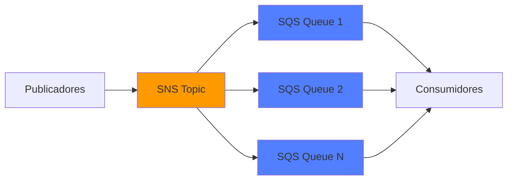

# Terraform AWS SNS-SQS Fanout

[](https://www.terraform.io/)
[](https://registry.terraform.io/providers/hashicorp/aws/latest)
[](LICENSE)
[](https://github.com/auztinorix/terraform-aws-sns-sqs-fanout)

> **Infrastructure as Code** para implementar el patrón de mensajería **publicación/suscripción (pub/sub)** con la opción de fanout y/o filtrado usando Amazon SNS y Amazon SQS en AWS, y empleando Terraform como herramienta de aprovisionamiento. La solución soporta configuraciones **FIFO** y **Standard** queues para máxima flexibilidad para distintos escenarios de integración.

El objetivo es demostrar una arquitectura **orientada a eventos**, desacoplada, escalable y reusable, aplicable tanto a **entornos reales de producción** como a **casos de aprendizaje y referencia arquitectónica**.

---

## 🎯 Propósito del proyecto

Este proyecto tiene como finalidad:

- Proveer un **ejemplo claro y modular** del patrón SNS → SQS Fanout
- Servir como **arquitectura de referencia** para soluciones event-driven
- Compartir **buenas prácticas de Terraform y AWS**
- Contribuir al aprendizaje de la comunidad AWS

Está orientado a:
- Arquitectos de soluciones
- Ingenieros cloud / platform
- Equipos de integración y middleware
- Miembros de la comunidad AWS

---

## 🗂️ ¿Qué hace este módulo?

Este módulo crea una infraestructura completa de mensajería:



**Características principales:**
- ✅ **Enrutamiento inteligente** - Filtra mensajes a colas específicas
- ✅ **FIFO o Standard** - Elige según tus necesidades
- ✅ **Listo para producción** - Cifrado, políticas IAM, validaciones
- ✅ **Multi-ambiente** - Soporte para dev, qas, staging, producción
- ✅ **Optimizado en costos** - Mejores prácticas incluidas

### 💼 Casos de Uso

#### FIFO (First-In-First-Out)
- ✅ **Procesamiento de órdenes:** Garantiza que las órdenes se procesen en el orden correcto
- ✅ **Transacciones financieras:** Orden crítico para integridad de datos
- ✅ **Eventos de estado:** Actualizaciones que deben procesarse secuencialmente
- ✅ **Workflow orchestration:** Pasos que dependen unos de otros

#### Standard (Alto Throughput)
- ✅ **Notificaciones masivas:** Emails, SMS, push notifications
- ✅ **Logs y métricas:** Alto volumen donde el orden no es crítico
- ✅ **Event broadcasting:** Distribución de eventos a múltiples servicios
- ✅ **Background jobs:** Tareas asíncronas independientes

---

## ⚡ Quickstart

```bash
# 1. Clonar el repositorio
git clone https://github.com/auztinorix/terraform-aws-sns-sqs-fanout.git
cd terraform-aws-sns-sqs-fanout

# 2. Configurar variables
cp environment-vars/dev.tfvars.example environment-vars/dev.tfvars
# Edita dev.tfvars con tus valores

# 3. Inicializar Terraform
terraform init

# 4. Planificar cambios
terraform plan -var-file="environment-vars/dev.tfvars"

# 5. Desplegar infraestructura
terraform apply -var-file="environment-vars/dev.tfvars"

```

**⏱️ Tiempo de despliegue:** ~3 minutos

---

## 📋 Requisitos

| Herramienta | Versión | Verificar | Link |
|-------------|---------|-----------| ---- |
| Terraform | >= 1.14.1 | `terraform --version` |[Instalar](https://developer.hashicorp.com/terraform/install) |
| AWS CLI | >= 2.0 | `aws --version` | [Instalar](https://docs.aws.amazon.com/cli/latest/userguide/getting-started-install.html) |
| Cuenta AWS | Activa | `aws sts get-caller-identity` | N/A |

<details>
<summary>Ver permisos IAM requeridos</summary>

Tu usuario AWS necesita permisos para:
- `sns:*` (CreateTopic, SetTopicAttributes, Subscribe, etc.)
- `sqs:*` (CreateQueue, SetQueueAttributes, etc.)
- `iam:CreatePolicy` y `iam:GetPolicy`

<!-- [Ver política IAM completa →](docs/INSTALACION.md#permisos-iam-requeridos) -->
</details>

---

## 🔧 Configuración Básica

### Configuración Standard

```hcl
# Perfecto para: Notificaciones, logs, eventos no críticos

env           = "dev"
project       = "notf"  # Exactamente 4 caracteres
functionality = "alerts"

fifo_topic = false  # Standard queue

queues = {
  "email" = {
    fifo_queue = false
    filter_policy = {
      channel = ["EMAIL"]
    }
  }
  
  "sms" = {
    fifo_queue = false
    filter_policy = {
      channel = ["SMS"]
    }
  }
}
```

### Configuración FIFO (Orden Garantizado)

```hcl
# Perfecto para: Transacciones, órdenes, operaciones financieras

env           = "dev"
project       = "shop"
functionality = "orders"

fifo_topic                  = true
content_based_deduplication = true

queues = {
  "payment" = {
    fifo_queue                  = true
    content_based_deduplication = true
    visibility_timeout_seconds  = 300
    filter_policy = {
      destination = ["PAYMENT"]
      priority    = ["HIGH", "CRITICAL"]
    }
  }
}
```

<!-- [📖 Ver todas las opciones de configuración →](docs/CONFIGURACION.md) -->

---

## 🎓 Ejemplos de Uso

### Publicar un Mensaje (FIFO)

```bash
aws sns publish \
  --topic-arn "arn:aws:sns:us-east-1:123456789012:prd-shop-orders-sns.fifo" \
  --message '{"orderId":"ORD-001","total":150.00}' \
  --message-attributes '{"destination":{"DataType":"String","StringValue":"PAYMENT"}}' \
  --message-group-id "orders" \
  --message-deduplication-id "ORD-001"
```

### Publicar un Mensaje (Standard)

```bash
aws sns publish \
  --topic-arn "arn:aws:sns:us-east-1:123456789012:dev-notf-alerts-sns" \
  --message "Hello World" \
  --message-attributes '{"destination":{"DataType":"String","StringValue":"EMAIL"}}'
```

### Consumir Mensajes (Python)

```python
import boto3
sqs = boto3.client('sqs')

response = sqs.receive_message(
    QueueUrl='url-de-tu-cola',
    MaxNumberOfMessages=10,
    WaitTimeSeconds=20  # Long polling
)

for message in response.get('Messages', []):
    print(message['Body'])
    sqs.delete_message(
        QueueUrl='url-de-tu-cola',
        ReceiptHandle=message['ReceiptHandle']
    )
```

<!-- [📚 Ver más ejemplos →](examples/) -->

---

## 🆚 FIFO vs Standard

| Característica | FIFO | Standard |
|----------------|------|----------|
| **Orden de Mensajes** | ✅ Garantizado | ⚠️ Mejor esfuerzo |
| **Deduplicación** | ✅ Automática | ❌ Manual |
| **Throughput** | 3,000 msg/s* | ♾️ Ilimitado |
| **Latencia** | ~20-30ms | ~10-15ms |
| **Costo** | Igual | Igual |

*Con batching y múltiples MessageGroups

**¿Cuándo usar cada uno?**
- 🎯 **FIFO:** Procesamiento de órdenes, transacciones financieras, cambios de estado
- 🚀 **Standard:** Notificaciones, logs, analytics, eventos no críticos

<!-- [📖 Comparación Detallada →](docs/FIFO_VS_STANDARD.md) -->

---

## 🔒 Seguridad

| Característica | Descripción | Beneficio |
|----------------|-------------|-----------|
| **Cifrado en Tránsito** | TLS 1.2+ para todas las comunicaciones | Protección de datos en movimiento |
| **Cifrado en Reposo** | AWS KMS (managed o custom keys) | Datos protegidos en storage |
| **Políticas IAM Automáticas** | Generación automática de permisos SNS → SQS | Principio de menor privilegio |
| **Validación de Permisos** | Verificación en tiempo de despliegue | Prevención de errores de acceso |
| **No Credenciales en Código** | Usa roles IAM y profiles AWS | Seguridad por diseño |

---

## 🧹 Limpieza de Recursos

### Destruir Infraestructura

Cuando termines de probar o ya no necesites los recursos:

```bash
# Ver qué se va a destruir
terraform plan -destroy -var-file="environment-vars/dev.tfvars"

# Destruir recursos (pide confirmación)
terraform destroy -var-file="environment-vars/dev.tfvars"

# O sin confirmación (cuidado)
terraform destroy -var-file="environment-vars/dev.tfvars" -auto-approve
```

> ⚠️ **Importante:** Destruir los recursos evita costos innecesarios. En desarrollo, destruye al finalizar cada sesión de pruebas.

---

## 🆘 Troubleshooting

<details>
<summary><b>¿Los mensajes no llegan a la cola?</b></summary>

**Verifica esto:**
1. El filter policy coincide con los message attributes
2. Los tipos de topic y cola coinciden (FIFO→FIFO o Standard→Standard)
3. Los permisos IAM son correctos
4. MessageGroupId está presente (solo FIFO)

```bash
# Verificar filter policy
aws sns get-subscription-attributes --subscription-arn TU_ARN

# Revisar métricas de la cola
aws sqs get-queue-attributes --queue-url TU_URL --attribute-names All
```

<!-- [🔧 Guía Completa de Troubleshooting →](docs/TROUBLESHOOTING.md) -->
</details>

<details>
<summary><b>¿Errores de "rate exceeded" en Terraform?</b></summary>

**Solución:**
```bash
# Reducir paralelismo
terraform apply -parallelism=1 -var-file="environment-vars/dev.tfvars"
```
</details>

<details>
<summary><b>¿Costos elevados?</b></summary>

**Victorias rápidas:**
- Habilitar long polling: `receive_wait_time_seconds = 20`
- Usar operaciones batch cuando sea posible
- Reducir retención en dev: `message_retention_seconds = 86400`
- Usar filtros eficientes para evitar procesamiento innecesario

<!-- [💰 Guía de Optimización de Costos →](docs/COSTOS.md) -->
</details>

---

## 📞 Soporte

- 💬 [Discusiones](https://github.com/auztinorix/terraform-aws-sns-sqs-fanout/discussions)
- 📧 [Email](mailto:fernandez.casasola.steven@gmail.com)

---

## 📄 Licencia

Este proyecto está bajo la Licencia MIT. Ver [LICENSE](LICENSE) para más detalles.

---

## 🌟 Agradecimientos

Si este proyecto te ayudó, considera:
- ⭐ Darle una estrella en GitHub
- 🐦 Compartir en redes sociales
- 📝 Escribir sobre tu experiencia
- 🤝 Contribuir con mejoras

**Creado con ❤️ para la comunidad AWS por [Auztinorix](https://github.com/auztinorix)**

---

<div align="center">

[](https://github.com/auztinorix/terraform-aws-sns-sqs-fanout)
[](https://github.com/auztinorix/terraform-aws-sns-sqs-fanout/fork)

[⬆️ Volver arriba](#terraform-aws-sns-sqs-fanout)

</div>